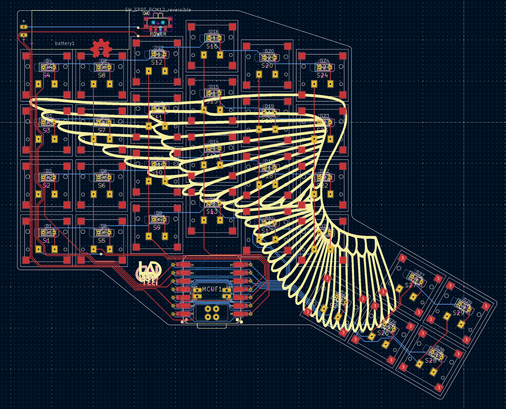

# Wings an ultra low profile split wireless keyboard

WIP Ultra low profile split keyboard using the kailh pg1316s.
[ergogen](https://github.com/ergogen/ergogen) was used to generate the position and overal shape.
My [fork](https://github.com/lad1337/ergogen) was used and it allows footprints to generate new net connections.
A special footprint *Placeholder* is used located at `config/footprints/placeholder.js`.
It also uses some [custom  footprints](https://github.com/lad1337/lad1337.pretty) i created

## Images

## Firmware

use [enki 42 zmk firmware with n!n dongle](https://github.com/aroum/zmk-enki42-dongle/tree/N!N_v2)

## Hardware

- 3 seeed xiao BLE (running in dongle mode)
- 60 kailh pg1316s
- 301230 3,7 V lipo (30 x 12 x 3)
- 1N4148W SOD-123 1206

## TODOS

- [x] Make it revsible
- [x] Route the board
- [x] Order keys and diods and hotplate
- [ ] Santity check PCB
- [ ] Order PCB
- [ ] Solder

## Other

- background wings art from https://pixabay.com/vectors/wing-angel-feathers-bird-white-295393/
